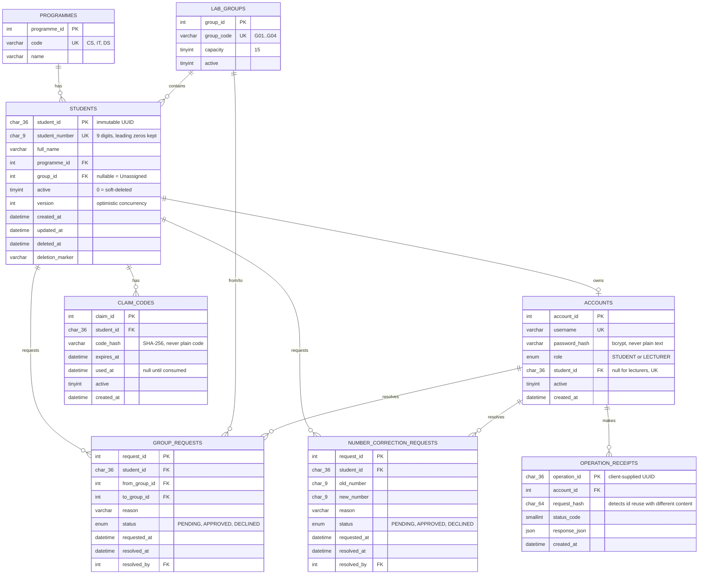

# ER diagram

Paste this block into any Mermaid renderer (GitHub renders it natively, or use
https://mermaid.live) for a visual version.

## Relationship notes

- **One student ↔ at most one account.** `accounts.student_id` is `UNIQUE`,
  so a student can never end up with two logins — this is what makes the
  claim-code flow's "link, don't duplicate" rule enforceable at the schema
  level, not just in application code.
- **A student belongs to at most one group at a time** (`students.group_id`
  is a single nullable foreign key, not a join table) — matches "one
  active student may belong to only one group."
- **Soft delete, not a separate table.** `deleted_at` / `deletion_marker` on
  `students` keep the row (and its reserved `student_number`) instead of
  moving it elsewhere, which would complicate every join above.
